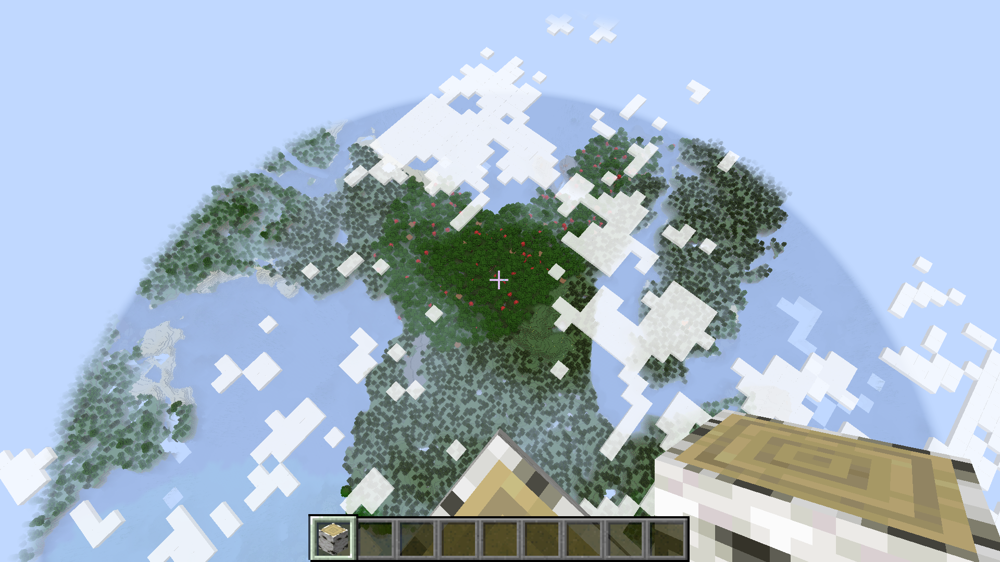
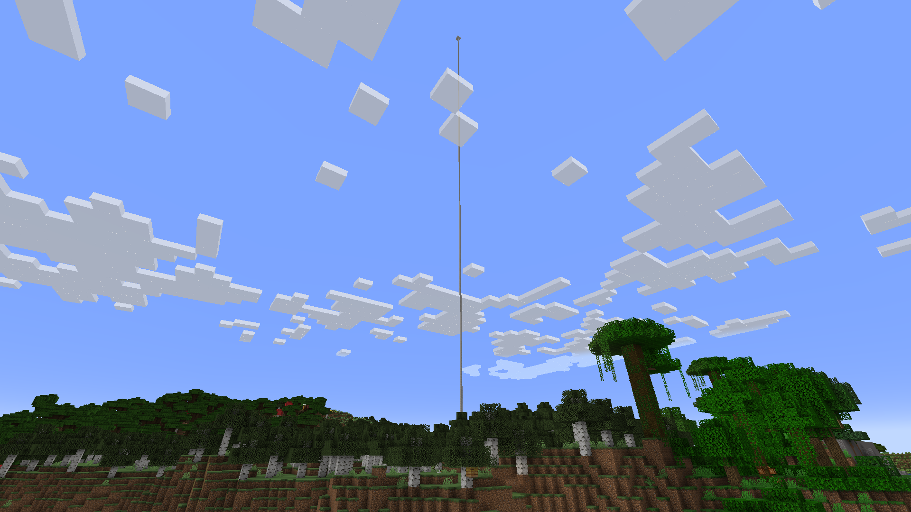

# Endless

Endless is a Minecraft mod that removes or customizes the build height limits of the game, allowing you to build beyond the vanilla restrictions.


## Features

- **Customizable Build Height**: Modify the minimum and maximum build heights in Minecraft through a simple configuration file
- **Remove Height Limits**: Optionally remove build height restrictions entirely, allowing building at extreme heights
- **Cross-Platform**: Compatible with both Forge and Fabric mod loaders




## Configuration

After launching Minecraft with the mod for the first time, a configuration file will be generated at `config/endless.json`. You can edit this file to customize the mod behavior:

```json
{
  "buildHeight": {
    "minBuildHeight": -64,
    "maxBuildHeight": 320,
    "removeBuildHeightLimit": false
  }
}
```

Options:

- `minBuildHeight`: The minimum Y-level at which blocks can be placed (default: -64)
- `maxBuildHeight`: The maximum Y-level at which blocks can be placed (default: 320)
- `removeBuildHeightLimit`: Set to `true` to remove build height limits entirely (default: false)

## Development

### Project Structure

- `common/`: Common code shared between all mod loaders
- `fabric/`: Fabric-specific implementation
- `forge/`: Forge-specific implementation

### Building from Source

1. Clone the repository
2. Run `./gradlew build` to build all mod versions
3. Find the built JARs in:
   - `fabric/build/libs/`
   - `forge/build/libs/`

## License

All Rights Reserved

## Author

- NsTut
