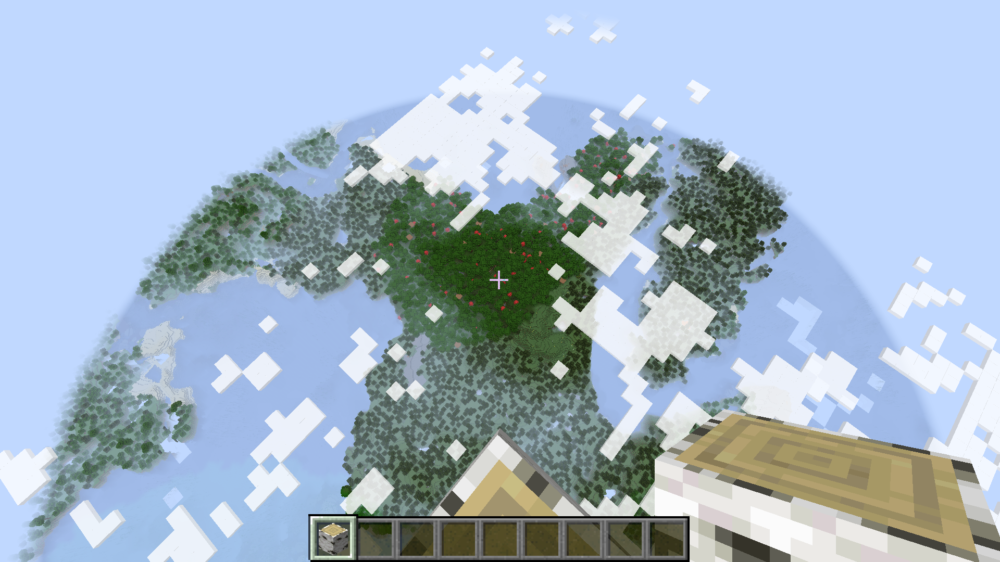
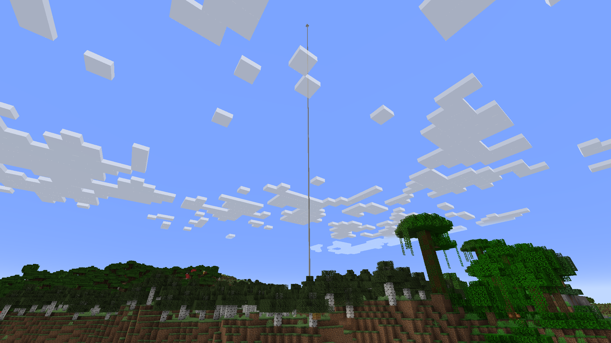

# Endless

Endless is a Minecraft mod that extends the build height limits of the game, allowing you to build up to Y=8192 and down to Y=-4096.
CurseForge: https://www.curseforge.com/minecraft/mc-mods/nstut-endless


## Features

- **Expanded Build Height** — Configure minimum and maximum build heights up to Y=8192 / Y=-4096
- **All Dimensions** — Works simultaneously in Overworld, Nether, and End
- **Cross-Platform** — Compatible with both Forge and Fabric
- **Void Damage** — Void damage triggers 64 blocks below your configured minimum, giving you room to build at the bottom
- **Waystones Compatible** — Place waystones anywhere within your expanded build range

> **Note:** Dynamic lighting updates are limited to y=-1024 to 1024 to prevent memory issues. Blocks placed outside this range may appear incorrectly lit.

> **Note:** Extending build height increases memory usage. Each chunk allocates 768 sections at max height (vs 24 in vanilla).




## Configuration

After launching Minecraft with the mod for the first time, a configuration file is generated at `config/endless.json`:

```json
{
  "buildHeight": {
    "minBuildHeight": -64,
    "maxBuildHeight": 320
  }
}
```

Options:

- `minBuildHeight`: Lowest Y-level for block placement (default: -64, minimum: -4096)
- `maxBuildHeight`: Highest Y-level for block placement (default: 320, maximum: 8192)

### Example: Full Height

```json
{
  "buildHeight": {
    "minBuildHeight": -4096,
    "maxBuildHeight": 8192
  }
}
```

### Recommended Balanced Range

```json
{
  "buildHeight": {
    "minBuildHeight": -512,
    "maxBuildHeight": 1024
  }
}
```

## Development

### Project Structure

- `common/` — Shared code for all mod loaders
- `forge/` — Forge-specific implementation
- `fabric/` — Fabric-specific implementation

### Building

```bash
git clone https://github.com/NsTut/Endless.git
cd Endless
./gradlew build
```

Output JARs in `forge/build/libs/` and `fabric/build/libs/`.

### Testing

```bash
./gradlew test          # Unit tests
./gradlew runClient     # Launch Forge client
./gradlew runServer     # Launch dedicated server
```

## License

All Rights Reserved

## Author

- NsTut
