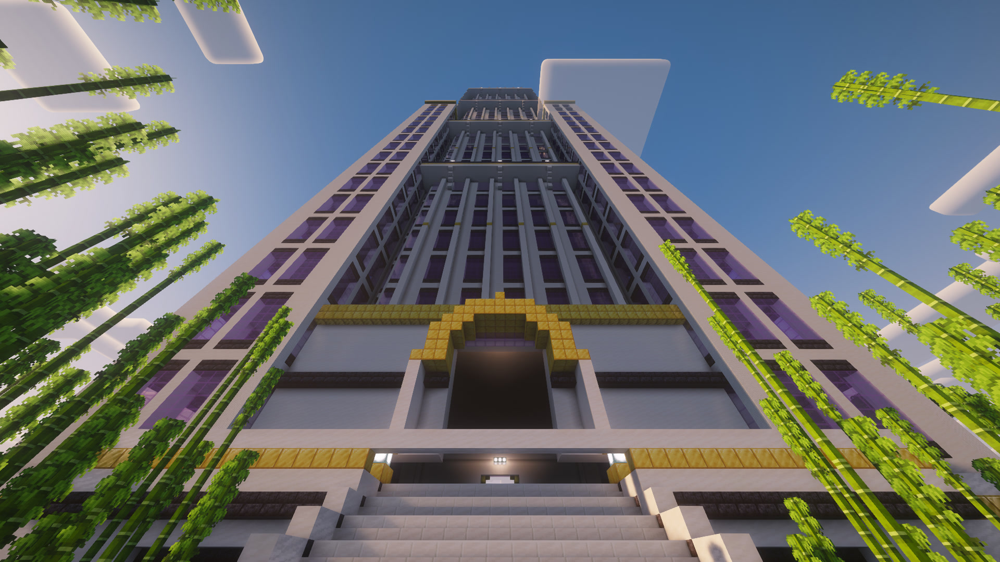

# Endless

Endless 0.9.3 provides sparse, practically unbounded vertical building space for Minecraft 1.20.1 (Fabric/Forge), 1.21.1 (Fabric/NeoForge), and 26.1.2 (NeoForge) without allocating a dense chunk column for the entire height.

**Supported configuration envelope:** Y=-8,000,000 through Y=7,999,999.

CurseForge: https://www.curseforge.com/minecraft/mc-mods/nstut-endless




## How Endless works

Vanilla Minecraft cannot safely make its normal `LevelChunkSection[]` millions of blocks tall. The supported versions also retain narrow packed-position or dense-section assumptions that cannot represent the full Endless envelope directly. Endless therefore separates the user-facing logical build range from the vanilla-compatible dense chunk core and stores extended space in sparse pages.

- `config/endless.json` defines the **logical build range** used by placement, commands, teleport validity, AI limits, rendering queries, and sparse routing. Any section-aligned subrange of `[-8000000, 8000000)` is supported.
- A fresh world keeps the **dense core** at vanilla `[-64, 320)`. Widening the logical config does not widen `LevelChunkSection[]`.
- Void fog fades at the configured logical floor in active sparse worlds, including air and water below Y=-64. Its vanilla colors, status effects and fade remain intact; legacy/inactive worlds keep their native floor. Terrain and biome mods do not need a separate void-fog patch.
- Existing worlds may retain a wider persisted dense core (up to `[-2032, 2032)`) when required to preserve Anvil sections. That internal range does **not** widen the configured build limit.
- Coordinates outside the dense core but inside the configured logical range are stored in **512-block sparse pages**. Empty height costs no section-array memory.
- Sparse pages use dedicated compressed NBT storage under each dimension instead of vanilla `ChunkSerializer`, so high section Y is never narrowed to a signed byte.
- High-Y `BlockPos` network fields use an Endless protocol extension. Positions that fit vanilla's packed envelope retain the normal vanilla wire encoding.
- The client receives only sparse pages near its current vertical window. The render grid follows the camera and stays 32 sections / 512 blocks tall.
- Sparse heightmaps, high-Y block/fluid access, block entities, POIs, scheduled ticks, neighbor updates, and page-aware lighting are integrated with the normal Level APIs.
- Horizontal chunk unload evicts its sparse pages after flushing dirty data, so visited height does not accumulate forever in memory.

The ±8,000,000 representation envelope is deliberate. It stays inside Minecraft 1.20.1's signed 20-bit `SectionPos` Y envelope, allowing POI and several section-keyed vanilla systems to remain correct while Endless replaces the much narrower packed `BlockPos` and dense-section assumptions.

## Features

- **Configurable Practical Infinite Height** — Choose any section-aligned logical build range from Y=-8,000,000 through Y=7,999,999.
- **Strict Configured Bounds** — Normal placement and vanilla commands use the configured logical min/max; the ±8M representation envelope is not automatically buildable.
- **Sparse Memory Use** — Only vertical pages that contain data are allocated or persisted; fresh extended worlds keep vanilla-sized dense section arrays.
- **All Dimensions** — Overworld, Nether, End, and other normal Level dimensions use their own sparse storage.
- **Forge + Fabric** — Same sparse engine and protocol on both loaders.
- **Persistent High-Y Blocks** — Extended pages save independently from Anvil chunk sections and reload lazily.
- **High-Y Fluids and Block Entities** — Level/LevelChunk access is routed through sparse pages while normal block lifecycle callbacks remain active.
- **Heightmap Overlay** — World-surface, ocean-floor, and motion-blocking height queries include sparse blocks.
- **Page-Aware Lighting** — Emissive blocks propagate block light across sparse page boundaries; sky exposure is evaluated against dense + sparse tops without packed-Y wrapping.
- **Sparse POI Support** — High-Y POIs use dedicated sparse persistence/search instead of widening vanilla SectionStorage loops.
- **Server-Authoritative Protocol** — The server synchronizes both its configured logical range and internal dense-core layout before chunk/page data is used.
- **Waystones Compatibility** — Waystones 1.20.1 placement uses the configured logical ceiling and high-Y Waystone block entities/positions travel through the extended storage/network path.
- **Create Compatibility** — Targeted compatibility and development-runtime regression gates for schematic rails and sparse kinetic networks on Forge 1.20.1 / Create 6.0.8 and NeoForge 1.21.1 / Create 6.0.11; this is not a blanket certification of Create or Flywheel.
- **Camera-Following Rendering** — A 512-block vertical render window follows the player instead of allocating GPU render chunks for millions of blocks.
- **Fail-Closed Existing-World Migration** — Existing dense-world layouts are validated before load; ambiguous or unsafe layouts stop startup instead of risking silent section loss.

## Configuration

`config/endless.json` configures the actual **logical build limit**:

```json
{
  "buildHeight": {
    "minBuildHeight": -1024,
    "maxBuildHeight": 1024
  }
}
```

- `minBuildHeight` is inclusive.
- `maxBuildHeight` is exclusive, so the example's highest legal block is Y=1023.
- Values are normalized to 16-block section boundaries and clamped only to the representation envelope `[-8000000, 8000000)`.
- Valid million-scale values are preserved across launch; they are not clamped back to the old ±2032 dense envelope.
- Restart after changing the file. The server's configured logical range is authoritative for multiplayer clients.

Changing a logical range can narrow or widen where players, commands, and compatible mods may operate. It does not delete sparse page files outside the newly narrowed range. Existing persisted dense sections are also retained internally for Anvil safety, but are inaccessible whenever they lie outside the current configured logical range.

### Existing worlds

Fresh 0.9.3 worlds keep a vanilla `[-64,320)` dense core. Existing worlds may have a wider persisted dense core when they already contain extended Anvil sections. That persisted dense layout never shrinks automatically.

Endless 0.9.3 uses fail-closed migration for existing dense-world data. Before chunks load, ambiguous section layouts, meaningful data in unsafe guard sections, conflicting heightmap packing, or untrusted migration inputs stop startup instead of allowing vanilla to silently discard sections.

Back up important worlds before upgrading to 0.9.3. Sparse pages do not reinterpret existing Anvil data; they are a storage layer outside the persisted dense core.

## Compatibility notes

Endless supports Minecraft 1.20.1 on Fabric/Forge, Minecraft 1.21.1 on Fabric/NeoForge, and Minecraft 26.1.2 on NeoForge. Sparse multiplayer requires matching Endless versions on the client and server, using the same Minecraft/loader line.

Mods that use ordinary `Level`, `LevelChunk`, `BlockPos`, block entity, tick, POI, heightmap, and brightness APIs can operate at high Y through Endless' routing. A mod that directly converts high-Y positions with `BlockPos.asLong()`, assumes `chunk.getSections()` contains every possible Y, or directly inspects vanilla light `DataLayer` storage can still impose vanilla's old bounds on itself. Those are representation-level assumptions that cannot be transparently fixed inside another mod's private data structures.

Waystones 1.20.1 is explicitly covered: its placement code normally treats `Level#getHeight()` as an absolute ceiling, while Endless deliberately keeps that accessor dense-core-sized. Endless redirects that Waystones placement check to the configured logical maximum and covers its high-Y block entity/position path in the real client/server compatibility test.

Create compatibility targets Forge 1.20.1 (Create 6.0.8) and NeoForge 1.21.1 (Create 6.0.11). The development-runtime gates exercise schematic rail placement, distinct sparse generator identities, fresh-JVM persistence against an independent checkpoint, and legacy-NBT reconstruction of two connected generators with a real stress consumer in root-first, follower-first, and late-follower load orders. Migration preserves Create's unloaded stress/capacity/member accounting. Interrupted saves reuse the allocator-owned root network already restored by a follower. Legacy followers whose full Source chain is unavailable receive separate persistent provisional identities and save `EndlessLegacyNetworkId` until they can rejoin their exact root; provisional identities do not propagate to neighbours. Generator and provisional allocations remain distinct even at the same full position. The runtime gate covers two aliased unresolved branches in both admission orders, pending-NBT reconstruction, and later root reconciliation. Sparse block-entity packets retain the native client callback, refreshing Create's cached Flywheel rotation. Both Create client gates check 600 shaft visuals across the dense boundary and at positive/negative million-scale Y through start, reversal, stop, and restart.

Each dimension's `data/endless_create_kinetic_ids.dat` is part of the world backup. Existing unreadable or invalid allocator data stops allocation instead of silently starting a new namespace. Namespace version 3 uses packed X=30,000,000, outside vanilla's legal horizontal bounds at every Y. Unsafe unversioned and version-2 allocator files are refused unchanged because those formats do not reliably distinguish provisional followers from generator ownership; they require an explicit offline migration or the build that created them. Restore the matching allocator and world state from a verified backup; do not delete or replace that file to suppress an error. A genuinely absent allocator is initialized for a new namespace, so deleting an established allocator is not a supported recovery procedure.

Display-link/redstone-link full-position persistence, arm interaction initialization, ejector selection, pulley limits, and elevator contact discovery use exact coordinates or the logical build envelope. The live gates exercise real APIs across the dense floor/ceiling, positive/negative sparse pages, packed-Y boundaries, and million-scale positions. Bearing, piston, and pulley fixtures reconstruct the moving entity, reattach it to its native controller, resume motion, and disassemble that restored entity, including mounted chest contents and drill actors. Separate phase-A world-saved machines must survive the fresh phase-B JVM. Elevator discovery searches occupied pages, including persisted pages, rather than scanning millions of empty cells. Train node packets preserve full doubled Y and pixel offsets, assembly-error NBT retains exact highlight positions, and chorus-potato destinations use logical bounds. Mining cracks use exact renderer-local coordinates, including Create's extra structure positions and their removal lifecycle.

### Embeddium, Oculus, Sodium and Iris

Endless supports the optional renderer adapter across all five release targets. Forge 1.20.1 supports Embeddium/Oculus; Fabric 1.20.1 supports Embeddium or Sodium/Iris; Fabric 1.21.1 supports Sodium/Iris; NeoForge 1.21.1 supports Embeddium or Sodium/Iris; NeoForge 26.1.2 supports Sodium/Iris. The supported release pins and reproducible test profiles are documented in [renderer compatibility](docs/Embeddium-Compatibility.md). Renderers are optional and never bundled. Their snapshots use the dense core or sparse pages, with a bounded terrain grid and matching block/sky light snapshots.

On Forge 1.20.1 with Embeddium/Oculus, the adapter also recovers Create 6.0.8 elevator-pulley global rendering when the pulley origin leaves the bounded terrain window. Elevator distance culling is measured against the rope render bounds, while recovered global block entities preserve Embeddium's native culling toggle, outline bookkeeping, and identity deduplication without scanning every loaded block entity each frame.

Initial and subsequent transparent mesh sorting preserve fractional camera movement at extreme heights. Block-entity mining overlays use Endless's exact position keys. Dense-core block/light updates and distant sparse page updates refresh visible skylight in nearby columns, including the snapshot halo immediately above and below the render window. A 512-block vertical render window can clip distant terrain above or below the camera. Fresh-world fixture capture instructions, the CI framebuffer smoke test and the supported validation scope are in [Embeddium compatibility](docs/Embeddium-Compatibility.md). The hidden-window capture fixture is excluded from ordinary release jars.

### Create contraption coordinates (#14)

Endless 0.9.3 stores versioned full XYZ local coordinates in Create's paletted block entries for both disk and entity-spawn NBT. Native block states, block-entity data, and update tags remain attached to their original entries. Existing entries without the extension keep Create's legacy interpretation; malformed extended coordinates are refused. Previously truncated data cannot be reconstructed automatically.

The default-cap regression builds real mounted contraptions with 2,047 and 2,048 payload blocks and checks every position/state after both disk and spawn serialization. The latter includes the anchor and local Y=+2048, which previously became -2048. Forge 1.20.1 and NeoForge 1.21.1 require matching clients with the current handshake (Forge protocol 6 / NeoForge protocol 7) because older clients cannot read the exact spawn keys and extended train nodes. These targeted tests do not certify every Create/Flywheel behavior, arbitrary addon, imported legacy contraption, passenger/collision workflow, or complete lighting/culling lifecycle.

## Limitations

- **World generation** remains in the normal generator range. Endless adds buildable sparse space; it does not generate terrain millions of blocks high by default.
- **Rendering** covers a 512-block vertical window around the camera. Far-away vertical pages remain saved and active server-side but are not rendered until the camera approaches them.
- **Representation envelope** is practical rather than mathematical infinity: `[-8,000,000, 8,000,000)`, chosen to preserve vanilla `SectionPos`-keyed systems.

## Development

Build and test:

```bash
./gradlew test
./gradlew build
```

Run one loader explicitly:

```bash
./gradlew runFabric1201Client
./gradlew runForge1201Client
./gradlew runFabric1211Client
./gradlew runNeoForge1211Client
./gradlew runNeoForge2612Client

./gradlew runFabric1201Server
./gradlew runForge1201Server
./gradlew runFabric1211Server
./gradlew runNeoForge1211Server
./gradlew runNeoForge2612Server
```

Use `./gradlew testAllVersions` for shared/version-specific unit tests and the NeoForge-backed allocator storage regression. Build release artifacts per Minecraft line (for example `:fabric-1.20.1:build :forge-1.20.1:build`, then the 1.21.1 targets in a separate Gradle invocation); Loom production transforms for different Minecraft mapping sets are intentionally isolated.

The live-join CI matrix starts real Fabric and Forge dedicated servers and clients. The extended scenario uses a configured `[-1024,1024)` logical range over a vanilla-sized dense core, exercises blocks, fluid, block entities, POIs, lighting, persistence, rendering and player travel at both configured sparse edges, executes real `/setblock` commands at and just outside those limits, and loads canonical Waystones+Balm artifacts to verify high-Y Waystone placement/manager/client state.

The release gate contains **44 required live cells**: 16 Fabric/Forge 1.20.1 core cells, 19 Create cells across Forge 1.20.1 and NeoForge 1.21.1, three port-runtime cells for Fabric 1.21.1 / NeoForge 1.21.1 / NeoForge 26.1.2, and six same-JVM rejoin cells covering all three modern targets. Each modern target tests both a migrated legacy `[-2032,2032)` dense save at Y=1,000,000 and a fresh `[-8,000,000,8,000,000)` world at Y=6,000,000. The reopen oracle validates generic vanilla block entities (chest, ender chest and shulker box) with full XYZ keys and requires them to enter a completed render section after save/close/reopen, without any interaction-triggered refresh. Both modern rejoin scenarios run at render distance 12 and also require visible solid geometry for ordinary blocks in two separate sections, including one without block entities.

## License

[MIT](LICENSE.txt)

## Author

- NsTut
